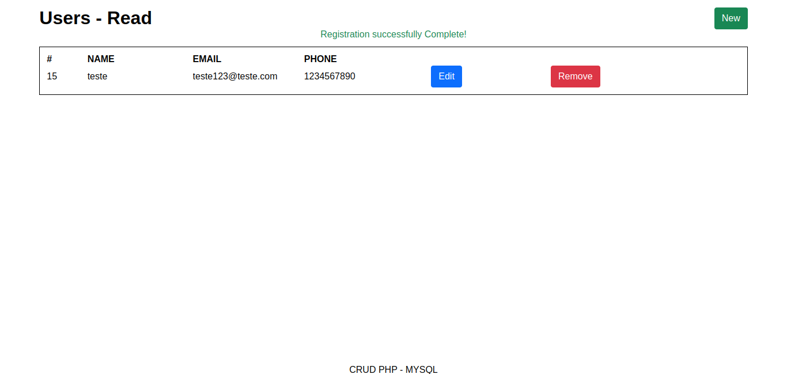

# Sistema de Cadastro de Usuários

Um sistema CRUD de cadastro de usuários. Cada um contendo id, nome, e-mail e telefone.

## Funcionalidades

 - CRUD de usuários

## Requisitos

 - PHP 8+
 - MySQL 8+

## Uso:
### Views:
 1. **Tela principal**
Assim que acessado, o sistema mostra uma lista com os usuários cadastrados.
**Botão "New"**:Navega para o formulário de cadastro de usuário.

 2. **Formulário para cadastrar usuário**:

 3. **Informações do usuário**:

 4. **Editar usuário**:

 5. **Banco de dados**:

 6. **Estrutura de banco:**
